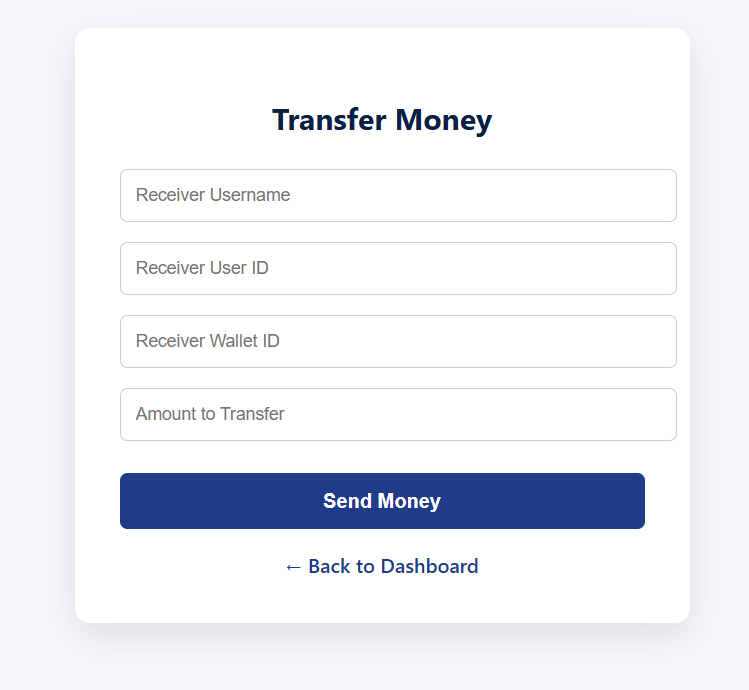
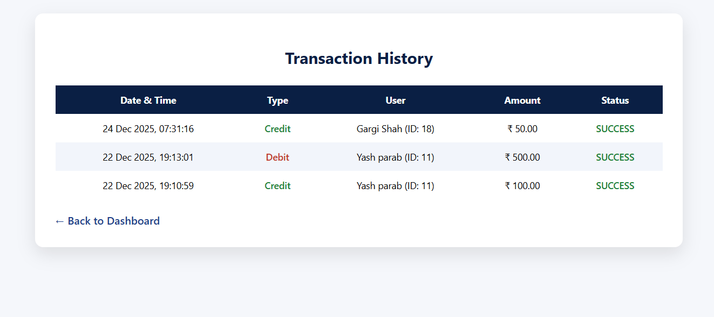

# Real-Time Transaction & Audit Log System

## Project Overview
This project implements a **real-time peer-to-peer fund transfer system with a mandatory audit trail**, designed to simulate real-world digital wallet behavior.
The system focuses on transactional integrity, security, and traceability, ensuring that every financial operation is permanently recorded and auditable.
---

## System Ensures
- Atomic fund transfers between users
- Permanent and immutable transaction records
- Secure access to wallet balances and history
- Backend-controlled validation and limits
- No partial or inconsistent transactions

---

## Key Features
- Peer-to-peer wallet transfers
- Mobile-number-based payments (registered users only)
- Immutable transaction audit log
- Daily transfer limit enforcement
- Secure authentication and authorization
- Complete transaction history per user
---

## Implementation Approach
- Django ORM is used to guarantee **database-level atomicity**.
- Wallet debit and credit operations are executed inside atomic transactions.
- A dedicated `Transaction` table acts as an immutable **audit log**.
- Transfers via mobile number are allowed only for registered users.
- Backend validations prevent invalid transfers and overdrafts.
---

## Screenshots

### Dashboard

### Transfer Money

### Transaction History

---

## Tech Stack

### Backend
- Python 3
- Django
- Django ORM
- PostgreSQL

### Frontend
- HTML5
- CSS3
- JavaScript

---

## Security & Data Integrity
- Django built-in authentication system
- Secure password hashing
- Database-level atomic transactions
- Server-side validations
- Authenticated access to all wallet operations
- Transactions are never modified or deleted

  ---
# Clone the repository
git clone https://github.com/VarshaGujrathi/Real_Time_Transaction_System.git
cd Transaction_system

# Create and activate virtual environment
python -m venv venv
venv\Scripts\activate          # Windows

# Install dependencies
pip install django psycopg2

# Apply database migrations
python manage.py migrate

# Start the development server
python manage.py runserver

## API Endpoints

### Authentication
| Method | Endpoint   | Description               |
|--------|------------|---------------------------|
| POST   | `/`        | User login / registration |
| GET    | `/logout/` | Logout authenticated user |

### Wallet & Transactions
| Method   | Endpoint        | Description                         |
|----------|-----------------|-------------------------------------|
| GET      | `/dashboard/`   | View wallet balance                 |
| POST     | `/add-money/`   | Add funds to wallet                 |
| POST     | `/transfer/`    | Transfer funds using user ID        |
| POST     | `/pay-mobile/`  | Transfer funds using mobile number  | 
| GET      | `/transactions/`| View transaction history            |

## Database Schema

### User (Django Default)
- `id`
- `username`
- `password`
- `mobile_number` 

### UserProfile
- `user` (OneToOne → User)
- `mobile_number` (unique)

### Wallet
- `user` (OneToOne → User)
- `balance`
- `created_at`

### Transaction (Audit Log)
- `sender` (ForeignKey → User)
- `receiver` (ForeignKey → User)
- `amount`
- `transaction_type` (`ADD_MONEY`, `TRANSFER`)
- `status` (`SUCCESS`, `FAILED`)
- `created_at`

> ⚠️ Transaction records are immutable and never deleted or updated.
## AI Tool Usage Log

AI tools were used strategically to enhance productivity and code quality:

- Generated initial Django project and transaction boilerplate
- Assisted in designing atomic database transaction logic
- Helped refine error handling and edge-case validations
- Improved frontend structure and CSS consistency
